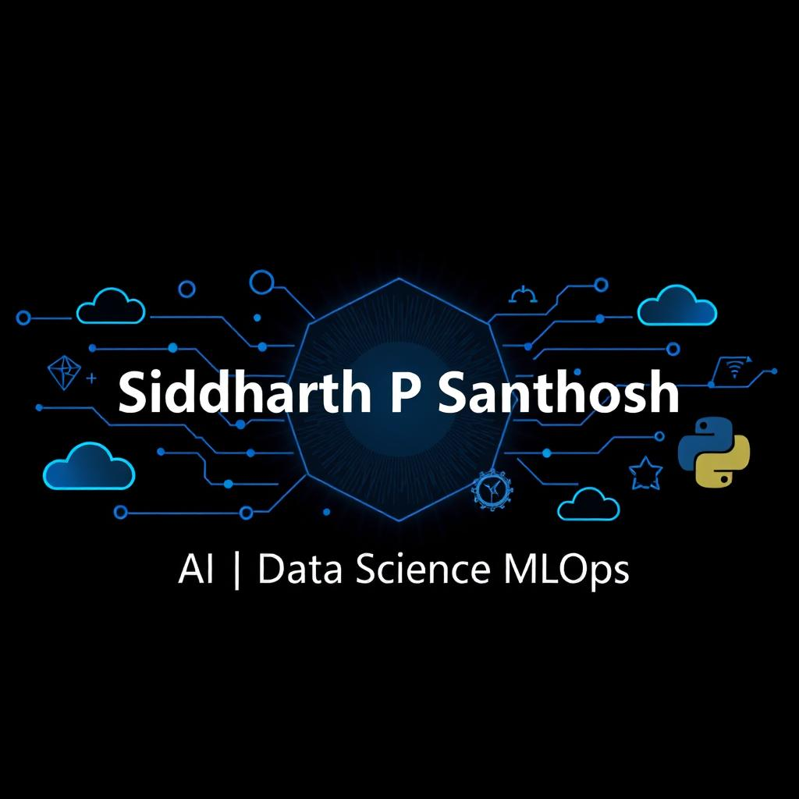

# AMAL M

###  🚀 **Aspiring Data Scientist** | 💡 **Passionate about AI & Machine Learning** | 📊 **Exploring Data-Driven Solutions**  

Welcome to my GitHub profile! I'm Amal M, a Data Science enthusiast with a passion for leveraging data to drive insights and solve complex problems. I am constantly expanding my skills and knowledge in the field of data science, and I am excited to share my journey with you through my project portfolio.

 ## Top Repositories
<a href="https://github.com/sid2002-N/ksrtc_concession_app">
     
 <a href="https://github.com/sid2002-N/skin-condition-prediction-">
    

## IDE

## Skills
- ### Languages
   
- ### AI/ML Ecosystem

  
   🔹 Data Handling & Processing

      NumPy – Numerical computing 
      Pandas – Data handling 
  🔹 visualization

      Matplotlib – Data visualization 
      Seaborn – Statistical plots 

  🔹 Machine Learning (ML)

      Scikit-learn – Traditional ML algorithms 
      XGBoost – Gradient boosting 

  🔹 Deep Learning (DL)

      TensorFlow – Deep learning framework
      Keras – Neural network API 
  

  🔹 Natural Language Processing (NLP)

      NLTK – Basic NLP processing 

  🔹 Computer Vision (CV)

      OpenCV – Image processing 

- ### Databases
  

- ### Tools
    

## Courses
  

## GitHub Analytics

## GitHub Streaks

## Trophie Stats

## Contact
   

